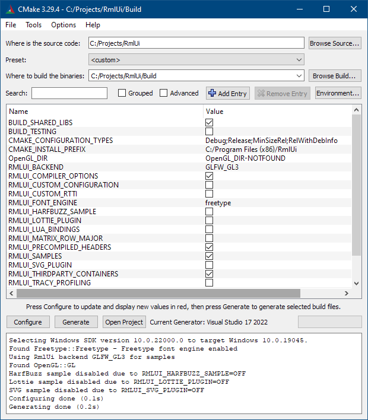

The following will guide you through the process of building RmlUi. This is necessary before you can integrate it into your own application. If you are just getting started, we also encourage you to build the included samples and have a look at them.

Requirements:
- [RmlUi](https://github.com/mikke89/RmlUi)
- [CMake](http://cmake.org)
- [FreeType](https://www.freetype.org)

*or*

- [Conan package manager](#conan)

*or*

- [vcpkg](#vcpkg)

***Note***: FreeType 2.11.0 introduced an issue causing a crash on startup of some of the samples. Please avoid this version, see [this issue](https://gitlab.freedesktop.org/freetype/freetype/-/issues/1092) for details.

RmlUi is based around CMake for building. You'll first need to download CMake or install it via the package manager of your choice. CMake is not a build system itself: its purpose is to generates Makefiles, Xcode projects and Visual Studio projects, among other formats.

If you haven't already done so, download a copy of RmlUi. You can download and extract the library as a zip file, or use git from your terminal:

```
git clone https://github.com/mikke89/RmlUi.git
```

### Building on Windows

This section is aimed at users of Visual Studio, however the procedure should be transferable to other environments.

In addition to CMake, you need a copy of the FreeType library, version 2.10.4 is officially supported (avoid 2.11.0, see above). You can find prebuilt dynamic Windows binaries [here](https://github.com/ubawurinna/freetype-windows-binaries). Create the directory `RmlUi/Dependencies/freetype`{:.path} if it does not exist, and copy the FreeType files here. Move the FreeType library file `RmlUi/Dependencies/freetype/win64/freetype.lib`{:.path} to the new location `RmlUi/Dependencies/lib/freetype.lib`{:.path}, and the include directory `RmlUi/Dependencies/freetype/include`{:.path} to the parent directory `RmlUi/Dependencies/include`{:.path}.

Next, start up `cmake-gui` and browse here to your RmlUi source code. Choose to build the binaries under `RmlUi/Build`{:.path}. Click configure and select your Visual Studio version. Now there will be a few options appearing. See the CMake options in the section below for a description of some of them. If you'd like to take a look at the included samples, enable the `BUILD_SAMPLES` option. Finally, click `Generate`. If it was successful, your Visual Studio solution file should be located at `RmlUi/Build/RmlUi.sln`{:.path}.



If you use the dynamic binary version of FreeType, copy the `RmlUi/Dependencies/freetype/win64/freetype.dll`{:.path} file into a place where the RmlUi applications can see it, such as  `RmlUi/Build`{:.path}. By default, this will be the working directory when starting applications from Visual Studio.

Open up the generated Visual Studio solution file. Now there should be several samples available in addition to the RmlCore and RmlDebugger projects. If you set the CMake option to build the samples, you can now right click on `invaders`, and click `Set as StartUp Project`. Finally, press `F5` to start building and open the invaders demo when done. Enjoy!

### Building on macOS and Linux

Before generating your build files you need to configure CMake. Open a terminal window, navigate to the RmlUi folder and create a `Build` folder:

```
buildbox:RmlUi$ mkdir Build
buildbox:RmlUi$ cd Build
```

Then execute the following command:

```
buildbox:RmlUi/Build$ ccmake ..
```

_NOTE_: You need the `..` to denote the directory where the `CMakeLists.txt`{:.path} is located.

This will open a text mode application that lets you choose which parts of RmlUi you want to build and how you want to build it. Before you can alter any options you'll need to press `C` so that CMake can scan your system configuration. Once it's complete you will see a list of options. See the CMake options below for what the most relevant options do. If you'd like to take a look at the included samples, enable the `BUILD_SAMPLES` option.

Make your selection and press `C` again so that CMake can recalculate build settings based on your selection. Once CMake is happy you'll be able to press `G` to generate the build configuration and then exit.

At this point you should be back at the terminal and your `Makefile`{:.path} will have been created. You can now build RmlUi by executing make.

```
buildbox:RmlUi/Build$ make -j 8
```

_NOTE_: The -j parameter specifies how many jobs to execute in parallel: you should normally set this to the number of threads supported by your CPU.

Once the build is complete, you may want to have a look at the samples.


### Building using Conan
{:#conan}

[Conan](https://conan.io) is a C/C++ package manager which can be used for integrating and building the library, and managing its dependencies in an effortless way. If you are new to Conan, then there is a relatively short [Getting Started](https://docs.conan.io/en/latest/getting_started.html) guide worth going through. Information on the RmlUi package itself is available at [ConanCenter: RmlUi](https://conan.io/center/rmlui).

The Conan recipe that environment-specific packages are generated from supports certain options derived from the [CMake options](#cmake-options) below. The following table explains options exclusive to RmlUi available in the recipe. Please bear in mind that in general the Conan community discourages double negation that would arise from naming options with one negation included (eg. `NO_THIRDPARTY_CONTAINERS`); this is why certain recipe options have the opposite meaning of their CMake counterpart.

 Conan option               | Possible values               | Default value  | Related CMake option          | Explanation
 ---------------------------|-------------------------------|----------------| ----------------------------- |--------------------------------------------------------------------
 enable_rtti_and_exceptions | [True, False]                 | True           | `DISABLE_RTTI_AND_EXCEPTIONS` | --
 font_interface             | ["freetype", None]            | "freetype"     | `NO_FONT_INTERFACE_DEFAULT`   | The CMake option is defined when the Conan option is set to `None`
 matrix_mode                | ["column_major", "row_major"] | "column_major" | `MATRIX_ROW_MAJOR`            | The CMake option is defined when the Conan option is set to `row_major`
 with_lua_bindings          | [True, False]                 | False          | `BUILD_LUA_BINDINGS`          | --
 with_thirdparty_containers | [True, False]                 | True           | `NO_THIRDPARTY_CONTAINERS`    | --

The options outlined above can be set in one's [conanfile.py](https://docs.conan.io/en/latest/reference/conanfile.html) or [conanfile.txt](https://docs.conan.io/en/latest/reference/conanfile_txt.html), depending on preference.

The CMake options that are not supported along with a bit of reasoning are as follows:
- `BUILD_SAMPLES` builds example uses of the library, which would significantly increase the size of pre-built binary packages that Conan generates. In order to avoid this, the option is not offered and is always disabled. However, the recipe can always be edited locally to try them out.
- `ENABLE_PRECOMPILED_HEADERS` requires a minimum CMake version that Conan can always provide and results in build time reduction with no apparent drawbacks, so it is sensible for it to be always enabled.
- `ENABLE_TRACY_PROFILING` requires a dependency that is not available from Conan's central repository as of writing this, so it cannot be supported.

The `CUSTOM_CONFIGURATION` CMake option and others related to it (`CUSTOM_CONFIGURATION_FILE`, `CUSTOM_INCLUDE_DIRS` and `CUSTOM_LINK_LIBRARIES`) make it possible for the embedded [robin-hood-hashing](https://github.com/martinus/robin-hood-hashing) library to be upgradable. It is now currently configured to use version [3.9.1](https://conan.io/center/robin-hood-hashing?version=3.9.1).

If the recipe is out of date or somehow does not meet certain needs, then contributions would be welcome at [conan-center-index](https://github.com/conan-io/conan-center-index).

### Building using vcpkg
{:#vcpkg}

[vcpkg](https://vcpkg.io) is a C/C++ package manager for acquiring and managing libraries. Read the [getting started with vcpkg](https://vcpkg.io/en/getting-started.html) guide to download and install the package manager.

Then, RmlUi can be installed simply using the command:
```
vcpkg install rmlui
```
Now you are all set to integrate RmlUi, all you need to do is include the header files into your source code.

The vcpkg port supports certain features derived from the [CMake options](#cmake-options) below.

 vcpkg feature   | Default feature  | Related CMake option          | Explanation
 ----------------|------------------| ----------------------------- |------------------------------------------------------
 freetype        | Yes              | `NO_FONT_INTERFACE_DEFAULT`   | Include the integrated font engine based on FreeType.
 lua             | No               | `BUILD_LUA_BINDINGS`          | Include the Lua bindings.

Note that vcpkg will not install the samples which we recommend to check out before integrating the library into your own project. For this, we need to download and build RmlUi manually, but luckily vcpkg can help ease this process by handling the dependencies.

First install the necessary dependency.
```
vcpkg install freetype
```

Then you can run the following commands to download and build RmlUi with the samples. Make sure to replace the path to vcpkg.
```
git clone https://github.com/mikke89/RmlUi.git
cd RmlUi
cmake -B Build -S . -DBUILD_SAMPLES=ON -DCMAKE_TOOLCHAIN_FILE="<path-to-vcpkg>/scripts/buildsystems/vcpkg.cmake"
cmake --build Build
```
Now please try out the freshly built `invader` sample and all the rest, enjoy! The executables should be located somewhere in the `Build` directory.

If you want to check out the remaining samples you can also install `lua sfml sdl2 sdl2-image glew` and additionally pass `-DBUILD_LUA_BINDINGS=ON` to the CMake configuration command.

If the version of RmlUi provided with vcpkg is out of date or somehow does not meet certain needs, then contributions would be welcome at the [vcpkg repository](https://github.com/microsoft/vcpkg).


### CMake options


- `BUILD_SAMPLES` - Enable to build the included samples.
- `BUILD_SHARED_LIBS` - Build shared libraries (dynamic libraries, .so/.dylib/.dll) as opposed to static libraries (.a/.lib). If the library is compiled *without* this option, then users of the library must specify `#define RMLUI_STATIC_LIB` before including the library.
- `BUILD_LUA_BINDINGS` - Build the required bindings for Lua support. You'll need Lua installed.
- `CMAKE_BUILD_TYPE` - Choose the build type between: Debug, Release, RelWithDebInfo, MinSizeRel, or None (passed in CMAKE_CXX_FLAGS flags are used).
- `NO_FONT_INTERFACE_DEFAULT` removes the default font engine, thereby allowing users to completely remove the FreeType dependency. If set, a custom font engine must be created and set through `Rml::SetFontEngineInterface` before initialization. See the `bitmapfont` sample for an example implementation of a custom font engine.
- `NO_THIRDPARTY_CONTAINERS`: RmlUi comes bundled with some third-party container libraries for improved performance. For users that would rather use the `std` counter-parts, this option is available. The option replaces the containers via a preprocessor definition. If the library is compiled with this option, then users of the library *must* specify `#define RMLUI_NO_THIRDPARTY_CONTAINERS` before including the library.
- `MATRIX_ROW_MAJOR`: By default RmlUi uses a column-major matrix implementation. By enabling this option, the matrix type is changed to a row-major representation. If this option is enabled, users must `#define RMLUI_MATRIX_ROW_MAJOR` before including the library.
- `DISABLE_RTTI_AND_EXCEPTIONS` will try to configure the compiler to disable RTTI language support and exceptions. All internal use of RTTI (eg. dynamic_cast) will then be replaced by a custom solution. If set, users of the library must then `#define RMLUI_USE_CUSTOM_RTTI` before including the library.
- `ENABLE_PRECOMPILED_HEADERS` enables the use of precompiled headers on supported compilers for speeding up compilation times. This requires CMake version 3.16.0 or greater and is enabled by default.
- `ENABLE_TRACY_PROFILING`: RmlUi has parts of the library tagged with markers for profiling with [Tracy Profiler](https://bitbucket.org/wolfpld/tracy/src/master/). This enables a visual inspection of bottlenecks and slowdowns on individual frames. To compile the library with profiling support, add the Tracy Profiler library to `/Dependencies/tracy/`, enable this option, and compile.  Follow the Tracy Profiler instructions to build and connect the separate viewer. The CMake setup will try to add a new configuration called 'Tracy' which can be selected in eg. Visual Studio next to the 'Debug' and 'Release' configurations, otherwise the profiler will be enabled on the entire project. Users can also add `#define RMLUI_ENABLE_PROFILING` for a given target to enable the profiler.
- `CUSTOM_CONFIGURATION`: RmlUi's default configuration `<RmlUi/Config/Config.h>`{:.incl} can be overriden by enabling this option. In this way it is possible to replace several types including containers to other STL-compatible containers (such as [EASTL](https://github.com/electronicarts/EASTL)), or to STL containers with custom allocators. After enabling this option, three new variables can be set:
  - `CUSTOM_CONFIGURATION_FILE`: Set the path to the new configuration file, the default configuration can be used as a template to create this file. Eg. `MyRmlUiConfig.h`{:.path}.
  - `CUSTOM_INCLUDE_DIRS`: Optionally set additional include directories that may be required by the new configuration file. Eg. `C:\MyProject\`{:.path}.
  - `CUSTOM_LINK_LIBRARIES`: Optionally set additional libraries to link with.
