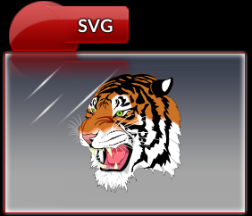

RmlUi comes integrated with the SVG plugin for rendering SVG vector images. The plugin uses the [LunaSVG](https://github.com/sammycage/lunasvg) library to render the SVG document.

When RmlUi is built with the SVG plugin, the `<svg>`{:.tag} element is available as a normal RML tag.


### \<svg\>

The `<svg>`{:.tag} element is used to include SVG vector images in the document.

_Attributes_

`src`{:.attr} = uri (CT)
: The source location of the SVG image.

`width`{:.attr} = number (CN)
: The width to force the element to, in pixels.

`height`{:.attr} = number (CN)
: The height to force the element to, in pixels.





### Building with the SVG plugin

The SVG plugin is integrated and built with the Core RmlUi library once it is enabled. Then, the plugin is automatically loaded during the call to `Rml::Initialise()`.

First, we demonstrate how to download and build the required [LunaSVG](https://github.com/sammycage/lunasvg) dependency. Open up a terminal and navigate to `RmlUi/Dependencies`{:.path}. Then execute the following commands.

```cmd
git clone --branch v2.3.0 https://github.com/sammycage/lunasvg
cd lunasvg
cmake -B build -S . -DBUILD_SHARED_LIBS=OFF -DLUNASVG_BUILD_EXAMPLES=OFF
cmake --build build --target lunasvg --config Debug
cmake --build build --target lunasvg --config Release
```

You may want to adjust the commands and CMake arguments to your preferences. The plugin is tested at the given version of LunaSVG, but newer versions may work.

Then, during [CMake configuration](building_with_cmake.html) of RmlUi, set the option `ENABLE_SVG_PLUGIN=ON`. This will ensure that the SVG plugin is integrated and built together with `RmlCore`. For example, in the `RmlUi/Build`{:.path} directory execute the following:

```cmd
cmake -DBUILD_SHARED_LIBS=OFF -DENABLE_SVG_PLUGIN=ON -DBUILD_SAMPLES=ON ..
```

This should automatically locate the `lunasvg` library. You can now build and run the included `svg` sample as you would any other sample to try out the plugin.


### Including the SVG plugin

To include the SVG plugin in your own project, make sure you build RmlUi with the CMake option `ENABLE_SVG_PLUGIN` enabled as described above, and [integrate RmlUi into your project](integrating.html) as normal. In addition, you will need to link with the `lunasvg` library.

The plugin is then automatically loaded during the call to `Rml::Initialise()`. If everything has worked out properly, the log will output a short message about the SVG plugin being initialised. The `<svg>`{:.tag} element should then be available for displaying vector images.
