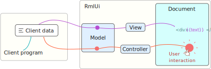

 
	The open and close brackets { { ... } } used in RmlUi's data binding syntax interferes with the Liquid templating language in Jekyll. We turn off Liquid processing by enabling raw mode for the entire document.




RmlUi features a model-view-controller (MVC) approach through data bindings. This is a powerful approach for responding to changes in the data, or in reverse, updating data based on user actions.

In the approach taken in RmlUi, the MVC terms have the following meaning.

- `Model`  The data model is the interface between the user data through data variables, and the views and controllers assigned to the model.
- `View`  Data views are used to present a data variable in the document by different means.
- `Controller` Data controllers typically respond to user input by setting a new value to a data variable.

Views are automatically updated whenever a variable becomes dirty. This ensures that the document displayed to the user is always synchronized with the application data. Using the MVC appoach, there is no need to handle individual elements, or manually modify the RML.

See the following detailed sections:

- [Examples](data_bindings/examples.html)
- [Data variables and expressions](data_bindings/expressions.html)
- [Data model](data_bindings/model.html)
- [Data views and controllers](data_bindings/views_and_controllers.html)

---

---

##### Limitations

- You should not affect the document structure within a data model. This includes manually adding or removing elements. Eg. removing an element inside a `data-for` view is undefined behavior and may lead to a crash.
- Currently, only top-level data variables can have a dirty state. That means data addresses can not be used to dirty just an Array index or Struct member. However, sub-values that have not been changed will be ignored inside the relevant views.
- Adding `data-` attributes after the element has been attached to the document has no effect.
- Registering `const` objects or members inheriting from a parent is currently not supported.
- Types may need to be re-registered if binding variables in different dynamic libraries.

##### Element compatibility

- Putting the `data-model` attribute on the `<body>`{:.tag} tag may cause issues when combined with templates.
- Some special elements internally change the structure of the document. For such elements, data bindings may not work as intended. This includes in particular the `<tabset>`{:.tag}, `<panel>`{:.tag} and `<tab>`{:.tag} elements, notably when combined with the `data-for` view.
- The `<select>`{:.tag} element may not always properly reflect changes in the underlying `selected`{:.attr} or `value`{:.attr} attributes of its `<option>`{:.tag}s, or the content of the options. For dynamically changing the selected option, use the `data-value` view on the `<select>`{:.tag} element. Note that, initially populating the options using `data-for` should now work.

##### Authoring notes

- Element attributes starting with `data-` are reserved for databindings in RmlUi.
- It is considered illegal to use `{{` and `}}` inside RML documents outside the context of data bindings.



 End raw mode, see the comment at the beginning of the document. 
