{: .gallery-item }
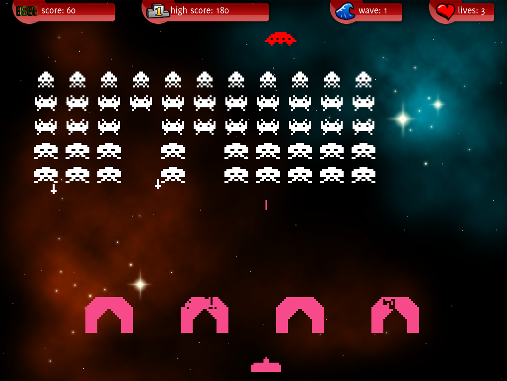  
Game interface from the 'invader' sample

{: .gallery-item }
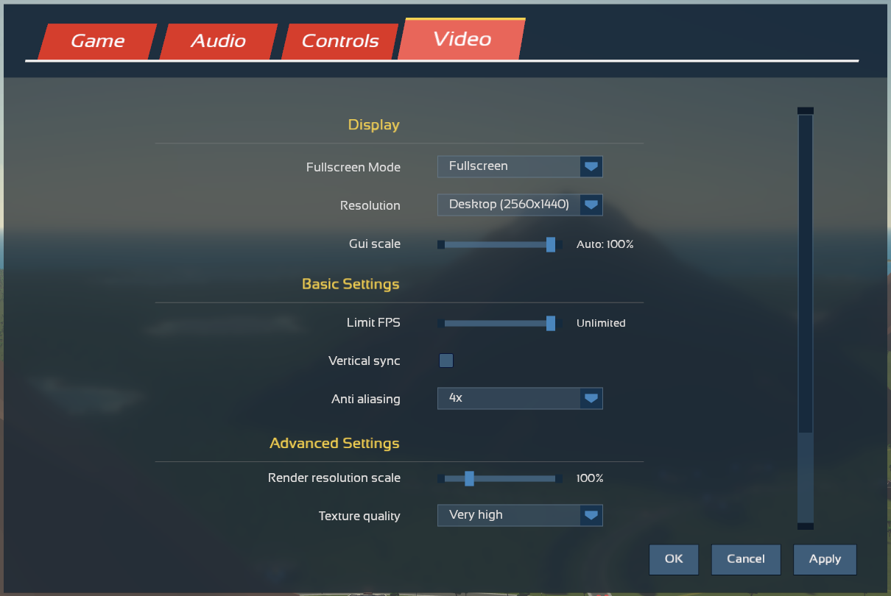  
Game menu

{: .gallery-item }
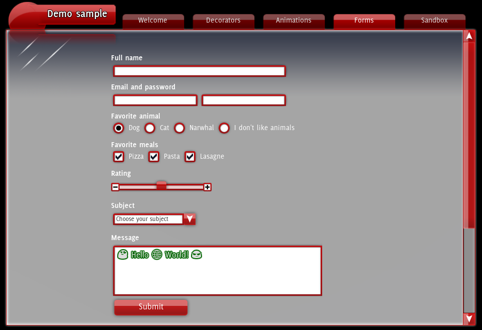  
Form controls from the 'demo' sample

{: .gallery-item }
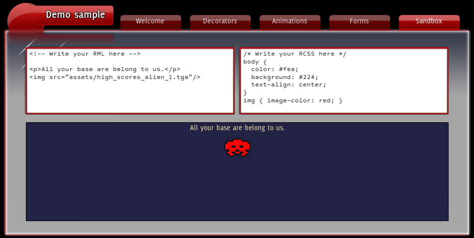  
Sandbox from the 'demo' sample, try it yourself!

{: .gallery-item }
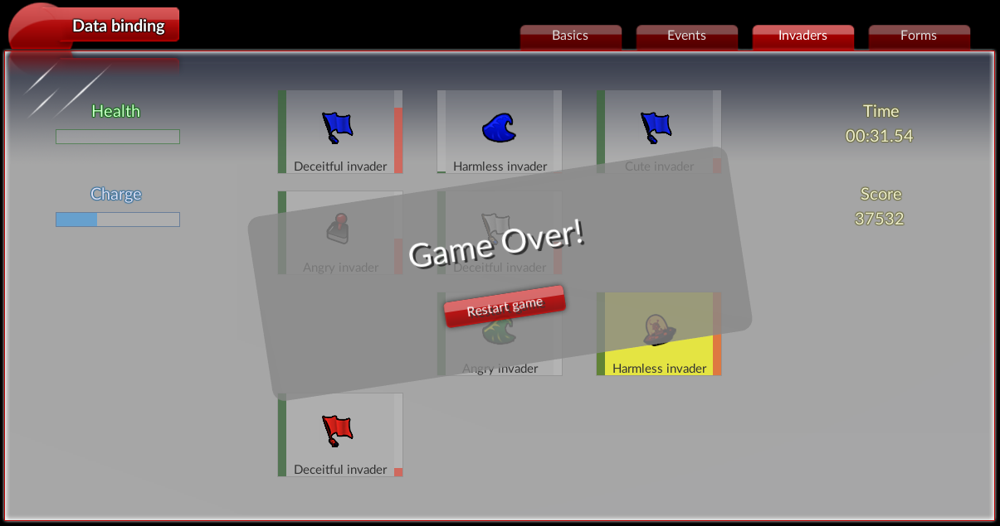  
Cute little game from the 'databinding' sample

{: .gallery-item }
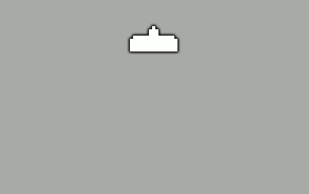  
Transitions on mouse hover (entirely in RCSS)

{: .gallery-item }
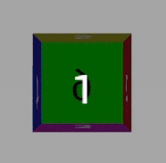  
Animated transforms (entirely in RCSS)

{: .gallery-item }
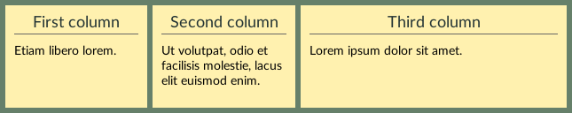  
Flexbox layout

{: .gallery-item }
  
Progress bars

{: .gallery-item }
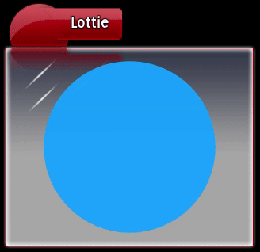  
Vector animations with the [Lottie plugin](cpp_manual/lottie.html)

{: .gallery-item }
  
SVG vector images with the [SVG plugin](cpp_manual/svg.html)

{: .gallery-item }
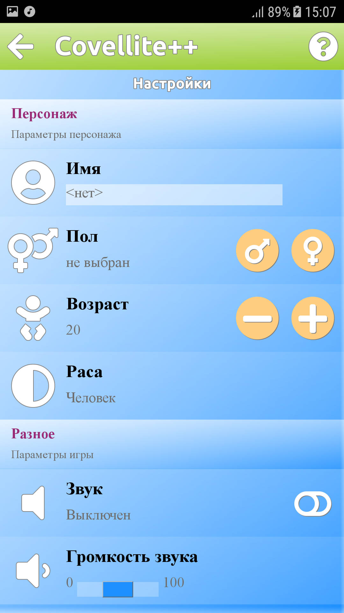
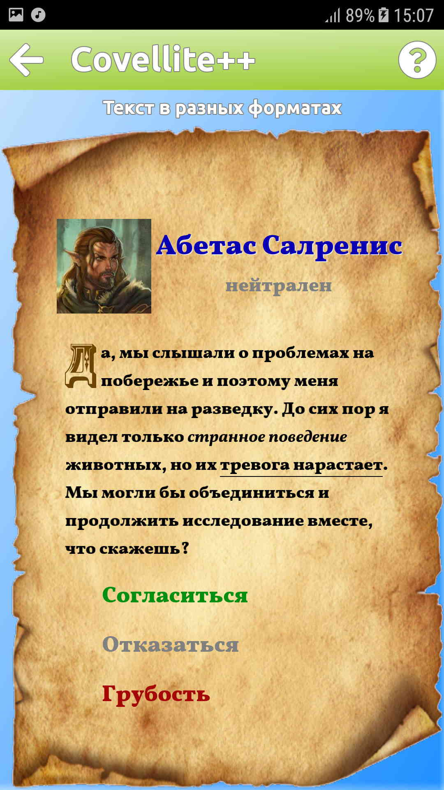  
[Covellite++](http://unicornum.github.io/Covellitepp/index.html) A cross-platform framework.

<video src="animations/animation_sample.webm" width="640" height="360" poster="animations/animation_sample_poster.png" preload="metadata" controls></video> 
Animations and transitions from the 'animation' sample

<video src="animations/game_main_menu.webm" width="640" height="360" poster="animations/game_main_menu_poster.png" preload="metadata" controls></video> 
Transitions with transforms on a game menu

<video src="animations/game_menu_transform.webm" width="640" height="360" poster="animations/game_menu_transform_poster.png" preload="metadata" controls></video> 
Camera movement in a game menu

