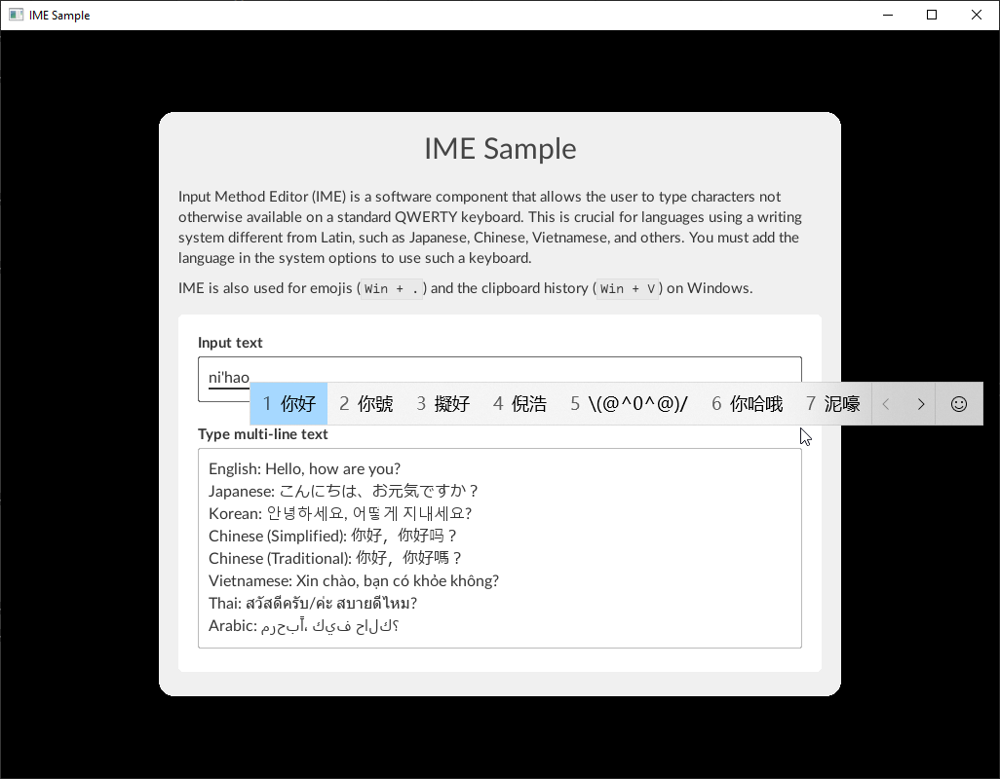

Input Method Editor (IME) is a software component that allows the user to type characters not otherwise available on a standard QWERTY keyboard. This is crucial for languages using a writing system different from Latin, such as Japanese, Chinese, Vietnamese, and others. Furthermore, operating systems may use the IME for complex inputs, such as the clipboard history or the emoji keyboard on Windows.

For full support, it is important to [load fonts](cpp_manual/fonts.html) covering the above-mentioned character sets.

### Sample

{{ page.lib_name }} ships with a `rmlui_sample_ime` sample demonstrating the IME support. It is available only on supported platforms.



In addition to being a standalone sample for full IME support, it loads system fonts as a fallback to properly represent other writing systems, such as Hangul, Mongolian, and others. Otherwise, they would only be rendered as missing characters when typing.

### Implementation

{{ page.lib_name }} intends to provide a default implementation for the system IME and tools for integrating your own system.

#### Default Implementation

By default, IME system messages are handled on the platform level by implementing a custom [text input handler](cpp_manual/interfaces/text_input_handler.html) globally set from the backend. Therefore, if you use the default backend implementations, overriding the global text input handler will deactivate the IME functionality.

The state of the IME support on different platforms is the following:

| Platform | IME | API   |
| -------- |:---:|:-----:|
| GLFW     | ❌   |       |
| SDL      | ❌   |       |
| SFML     | ❌   |       |
| Win32    | ✔️   | IMM32 |
| X11      | ❌   |       |

If you do not use the provided backends but include the platform files and wish to have the IME handled by {{ page.lib_name }}, you may use the platform's implementation of a text input handler, available in its header file. You may also have to pass this instance to the system message handler.

For Win32, the implementation will look like the following:

```cpp
#include <Backends/RmlUi_Platform_Win32.h>

static Rml::Context *context = nullptr;
static Rml::UniquePtr<TextInputMethodEditor_Win32> text_input_method_editor;

// Local event handler for window and input events.
static LRESULT CALLBACK WindowProcedureHandler(HWND window_handle, UINT message, WPARAM w_param, LPARAM l_param)
{
    return RmlWin32::WindowProcedure(context, *text_input_method_editor, window_handle, message, w_param, l_param);
}

int APIENTRY WinMain(HINSTANCE /*instance_handle*/, HINSTANCE /*previous_instance_handle*/, char* /*command_line*/, int /*command_show*/)
{
    // Initialize the window and graphics API being used, along with the renderer, system, and other interfaces, ...

    // ...

    // Instantiate the text input handler managing the IME.
    text_input_method_editor = Rml::MakeUnique<TextInputMethodEditor_Win32>();

    // Install the custom interface.
    Rml::SetTextInputHandler(text_input_method_editor.get());

    // Now we can initialize RmlUi.
    Rml::Initialise();

    // Create a context next.
    context = Rml::CreateContext("main", Rml::Vector2i(window_width, window_height));
    if (context == nullptr)
    {
        Rml::Shutdown();
        return -1;
    }

    // Load documents, handle the application loop, ...

    // ...

    // Shutting down RmlUi releases all its resources, including contexts that work with the text input handler.
    Rml::Shutdown();

    // It is now safe to destroy the custom interfaces previously passed to RmlUi, such as the text input handler.
    text_input_method_editor.reset();

    return 0;
}
```

A real application will be properly abstracted and more complex. This is only a simple example inspired by the [Initialization and main loop](cpp_manual/main_loop.html) tutorial.

#### Custom Implementation

The default implementation may not always be the best solution for a custom game engine, mainly if you use a different API than the provided one (for example, Text Services Framework instead of IMM32 on Windows).

##### System Interface

The IME is heavily tied to the platform, for instance, in positioning the candidate window. This can be done via the `Rml::SystemInterface` interface by overriding the `ActivateKeyboard()` method, which gets sent the current absolute cursor position and line height:

```cpp
#include <RmlUi/Core/SystemInterface.h>

class SampleSystemInterface : public Rml::SystemInterface {
private:
    void ActivateKeyboard(Rml::Vector2f caret_position, float line_height) override;

private:
    HWND window_handle;
};

void SampleSystemInterface::ActivateKeyboard(Rml::Vector2f caret_position, float line_height)
{
    HIMC himc = ImmGetContext(window_handle);
    if (himc == NULL)
        return;

    constexpr LONG BottomMargin = 2;

    // Adjust the position of the input method editor (IME) to the caret.
    const LONG x = static_cast<LONG>(caret_position.x);
    const LONG y = static_cast<LONG>(caret_position.y);
    const LONG w = 1;
    const LONG h = static_cast<LONG>(line_height) + BottomMargin;

    COMPOSITIONFORM comp = {};
    comp.dwStyle = CFS_FORCE_POSITION;
    comp.ptCurrentPos = {x, y};
    ImmSetCompositionWindow(himc, &comp);

    CANDIDATEFORM cand = {};
    cand.dwStyle = CFS_EXCLUDE;
    cand.ptCurrentPos = {x, y};
    cand.rcArea = {x, y, x + w, y + h};
    ImmSetCandidateWindow(himc, &cand);

    ImmReleaseContext(window_handle, himc);
}
```

Because `ActivateKeyboard()` gets invoked on every action of the text input area, the candidate window will always be positioned next to the caret.

##### Text Input Context

Existing game engines usually provide an interface to connect them with external GUI solutions, such as {{ page.lib_name }}. For this, the text input widget implements the `Rml::TextInputContext` interface, which can be interacted with by implementing the `Rml::TextInputHandler` interface.

```cpp
#include <RmlUi/Core/TextInputHandler.h>

class TextInputMethodEditor : public Rml::TextInputHandler {
private:
    void OnActivate(Rml::TextInputContext* input_context) override;
    void OnDeactivate(Rml::TextInputContext* input_context) override;
    void OnDestroy(Rml::TextInputContext* input_context) override;

private:
    // An actively used text input method context.
    Rml::TextInputContext* active_input_context = nullptr;
};

void TextInputMethodEditor::OnActivate(Rml::TextInputContext* input_context)
{
    active_input_context = input_context;
}

void TextInputMethodEditor::OnDeactivate(Rml::TextInputContext* input_context)
{
    if (active_input_context == input_context)
        active_input_context = nullptr;
}

void TextInputMethodEditor::OnDestroy(Rml::TextInputContext* input_context)
{
    if (active_input_context == input_context)
        active_input_context = nullptr;
}
```

Install the new handler globally with `Rml::SetTextInputHandler()` or pass it during context construction.

```cpp
class TextInputMethodEditor;

class RmlApplication {
public:
    bool Initialize();
    void Shutdown();

    // ... rest of the public interface ...

private:
    // ... other interfaces and private members ...

    Rml::UniquePtr<TextInputMethodEditor> text_input_method_editor;
};

bool RmlApplication::Initialize()
{
    // Instantiate other interfaces, such as the file system.

    // ...

    // Instantiate the custom text input method editor and install it globally.
    text_input_method_editor = Rml::MakeUnique<TextInputMethodEditor>();
    Rml::SetTextInputHandler(text_input_method_editor.get());

    // Once all interfaces are setup, we can initialize {{ page.lib_name }}.
    return Rml::Initialise();
}

void RmlApplication::Shutdown()
{
    Rml::Shutdown();

    // Custom interfaces will be automatically destroyed in the destructor.
}
```

`Rml::TextInputContext` exposes all necessary methods for manipulating the underlying text input area, like retrieving the current selection range, replacing a part of the text value, obtaining the element's bounding box, or updating the composition range (e.g., for visual feedback). You can treat this context as an implementation for your game engine's existing IME system or create your own editor. See the [platform implementations](https://github.com/mikke89/RmlUi/tree/master/Backends) for specific examples.

##### Text Field Elements

If you want to avoid using a text input handler (and the text input context, respectively) and directly access the element, both `Rml::ElementFormControlInput` and `Rml::ElementFormControlTextArea` expose the necessary methods to implement, such as `SetCompositionRange()` for setting the visual feedback used for the composition in the range. Note that the range is reset on every value change.

Compared to the previous technique, you must handle activation and deactivation events and custom text input elements yourself.
