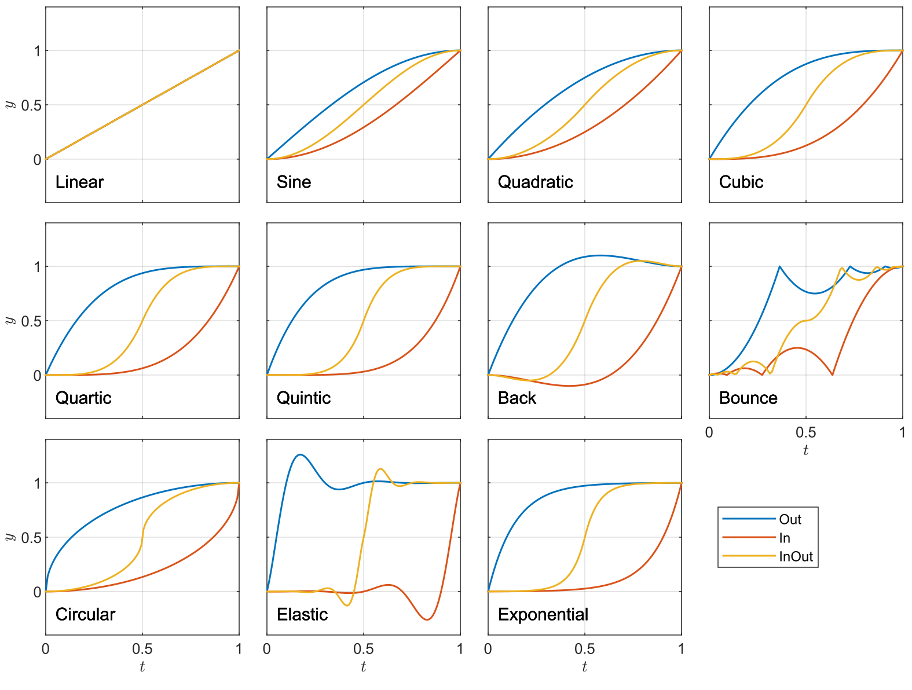

RmlUi provides comprehensive support for animations, transitions, and transforms. Together, they can be used to build very rich user experiences. These features are generally modeled after the CSS3 specifications, with some differences.

See also the [C++ documentation](../cpp_manual/animations_transforms.html) on animations and transforms.

### Animations
{:#animation}


Most RCSS properties can be animated, this includes properties representing numbers, lengths, percentages, angles, colors, transforms, and keywords. Animations can be specified entirely in RCSS, with keyframes.
```css
animation: <duration> <delay> <tweening-function> <num_iterations|infinite> <alternate> <paused> <keyframes-name>;
```
All values, except `duration`{:.value} and `keyframes-name`{:.value}, are optional. `delay`{:.value} must be specified after `duration`{:.value}, otherwise values can be given in any order. Keyframes are specified [as in CSS](https://developer.mozilla.org/en-US/docs/Web/CSS/@keyframes), see the example below. Tweening functions specify how the animated value progresses during the animation cycle. See [tweening functions](#tweening-functions) below for details.

Multiple animations can be specified on the same element by using a comma-separated list. 

RCSS example usage:

```css
@keyframes my-progress-bar
{
	0%, 30% {
		background-color: #d99;
	}
	50% {
		background-color: #9d9;
	}
	to { 
		background-color: #f9f;
		width: 100%;
	}
}
#my_element
{
	width: 25px;
	animation: 2s cubic-in-out infinite alternate my-progress-bar;
}
```

Internally, animations apply their properties on the local style of the element. Thus, mixing RML style attributes and animations should be avoided on the same element.

See the `animation` sample for more examples and details.


### Transitions
{:#transition}

Transitions apply an animation between two property values on an element when its property changes. Transitions are implemented in RCSS similar to how they operate in CSS. However, in RCSS, they only apply when a class or pseudo-class is added to or removed from an element.

```css
transition: <space-separated-list-of-properties|all|none> <duration> <delay> <tweening-function>;
```
The property list specifies the properties to be animated. `delay`{:.value} and `tweening-function`{:.value} are optional. `delay`{:.value} must be specified after `duration`{:.value}, otherwise values can be given in any order. Multiple transitions can be specified on the same element by using a comma-separated list. The [tweening function](#tweening-functions) is specified as in the `animation`{:.prop} property.


Example usage:

```css
#transition_test {
	transition: padding-left background-color transform 1.6s elastic-out;
	transform: scale(1.0);
	background-color: #c66;
}
#transition_test:hover {
	padding-left: 60px;
	transform: scale(1.5);
	background-color: #ddb700;
} 
```

See the `animation` sample for more examples and details. 


### Tweening functions
{:#tweening-functions}

Animations and transitions can optionally take a *tweening* function, which specifies how the animated value progresses during the animation cycle. Here, we deviate from the CSS specs where they are instead called `animation-timing-function`{:.value}s.

A tweening function in RCSS is specified as `<name>-in`{:.value}, `<name>-out`{:.value}, or `<name>-in-out`{:.value}, with one of the following names,

- `back`{:.value}
- `bounce`{:.value}
- `circular`{:.value}
- `cubic`{:.value}
- `elastic`{:.value}
- `exponential`{:.value}
- `linear`{:.value}
- `quadratic`{:.value}
- `quartic`{:.value}
- `quintic`{:.value}
- `sine`{:.value}

See the animation and transition documentation above for usage examples there. Each tweening function provides a specific mapping between normalized time and used interpolation value, which can be seen in the following plot.

<div style="text-align: center">
	
</div> 

See also the `demo` sample, where users can play with different tweening functions and durations, and see the resulting animation. It is also possible to provide a custom tweening function in the [C++ animation API](../cpp_manual/animations_transforms.html).


### Transforms
{:#transform}

Transforms can be applied to elements using the `transform`{:.prop} property. The related properties `transform-origin`{:.prop}, `perspective`{:.prop}, and `perspective-origin`{:.prop} are also supported in RCSS, which controls aspects of how the transform will be applied and rendered. These are roughly equivalent to their respective [CSS properties](https://developer.mozilla.org/en-US/docs/Web/CSS/transform).

```css
perspective: 1000px;
perspective-origin: 20px 50%;
transform: rotateX(10deg) skew(-10deg, 15deg) translateZ(100px);
transform-origin: left top 0;
```

All transform properties and their argument types are as follows:
```
perspective,  length1
matrix,       abs_numbers6
matrix3d,     abs_numbers16
translateX,   length1
translateY,   length1
translateZ,   length1
translate,    length2
translate3d,  length3
scaleX,       number1
scaleY,       number1
scaleZ,       number1
scale,        number2
scale,        number1
scale3d,      number3
rotateX,      angle1
rotateY,      angle1
rotateZ,      angle1
rotate,       angle1
rotate3d,     number3angle1
skewX,        angle1
skewY,        angle1
skew,         angle2
```

Angles take units of 'deg' or 'rad'. See the `transform` sample and `animation` sample for more examples.


RmlUi has full interpolation support for transforms, making them very attractive to use in combination with animations and transitions.

<video src="../animations/animation_sample.webm" width="640" height="360" poster="../animations/animation_sample_poster.png" preload="metadata" controls></video>

The following video demonstrates transitions with transforms on a main menu.

<video src="../animations/game_main_menu.webm" width="640" height="360" poster="../animations/game_main_menu_poster.png" preload="metadata" controls></video>

With transforms applied to the elements, we can essentially move the camera as if in three-dimensional space by changing the perspective and origin, as shown in the following.

<video src="../animations/game_menu_transform.webm" width="640" height="360" poster="../animations/game_menu_transform_poster.png" preload="metadata" controls></video>
