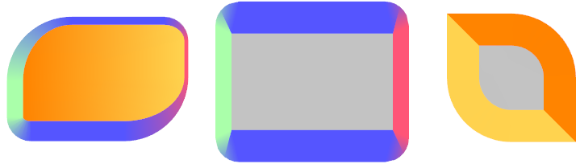

### Foreground colour: the 'color' property
{:#color}

`color`{:.prop}

Value: | \<colour\>
Initial: | black
Applies to: | all elements
Inherited: | yes
Percentages: | N/A

This property sets the colour of rendered text and text decorations.

### Background colour
{:#background-color}

In RCSS, an element's background can be set as a flat colour but not an image. This functionality (and much more!) instead lies with [decorators](decorators.html).

`background-color`{:.prop}

Value: | \<colour\>
Initial: | transparent
Applies to: | all elements
Inherited: | no
Percentages: | N/A

This property sets the color of the element's generated boxes. The background colour is rendered under a box's padded area.

`background`{:.prop}

An alias for `background-color`{:.prop}.

### Rounded corners
{:#border-radius}



The border radius properties can be used to draw rounded backgrounds and borders.

`border-top-left-radius`{:.prop}, `border-top-right-radius`{:.prop}, `border-bottom-right-radius`{:.prop}, `border-bottom-left-radius`{:.prop}

Value: | \<length\>
Initial: | 0px
Applies to: | all elements
Inherited: | no
Percentages: | N/A

The properties set the radius of the outer border edge for the given corner. Backgrounds and borders will be shaped accordingly. Decorators do not always respect this property, currently, only the [gradient decorator](decorators/gradient.html) will properly clip to the rounded corner. Note that unlike CSS, RmlUi does not support percentages or elliptic values (two values per corner).

*Note*: For decent looking results, the renderer should have anti-aliasing enabled when drawing the geometry generated by this property.

`border-radius`{:.prop}

A shorthand property for setting all four border radii properties at once. If there is only one value, it applies to all corners. If there are two values, the first applies to the top-left and bottom-right, the second to bottom-left and top-right. If there are three values, the first applies to the top-left, the second to bottom-left and top-right, the third to the bottom-right. If there are four values, they are applied to top-left, top-right, bottom-right, bottom-left respectively.

### Opacity
{:#opacity}

Opacity can be set on any element. Then, the generated geometry for the element will multiply the alpha channel of the vertex colors by the opacity.

`opacity`{:.prop}

Value: | \<number\>
Initial: | 1
Applies to: | all elements
Inherited: | yes
Percentages: | N/A

### Image colour: the 'image-color' property
{:#image-color}

`image-color`{:.prop}

Value: | \<colour\>
Initial: | white
Applies to: | \ elements and [decorators](decorators.html)
Inherited: | no
Percentages: | N/A

An extension to CSS for RCSS which multiplies a colour with images in ``{:.tag} tags and image decorators. Useful for `:hover`{:.cls} pseudo-class and for applying transparency.

Example:
```css
image-color: rgba(255, 160, 160, 200);
decorator: image( background.png );
```
