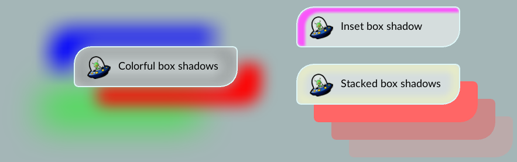

### Foreground colour: the 'color' property
{:#color}

`color`{:.prop}

Value: | \<colour\>
Initial: | black
Applies to: | all elements
Inherited: | yes
Percentages: | N/A

This property sets the colour of rendered text and text decorations.

### Background colour
{:#background-color}

In RCSS, an element's background can be set as a flat colour but not an image. This functionality (and much more!) instead lies with [decorators](decorators.html).

`background-color`{:.prop}

Value: | \<colour\>
Initial: | transparent
Applies to: | all elements
Inherited: | no
Percentages: | N/A

This property sets the color of the element's generated boxes. The background colour is rendered under a box's padded area.

`background`{:.prop}

An alias for `background-color`{:.prop}.

### Box shadows
{:#box-shadow}

Box shadows produce a shadow effect around or inside the element's box. The shadow is placed on the background of the element.

To use box shadows, the backend renderer must support advanced rendering features, see the [render interface feature table](../cpp_manual/interfaces/render.html#feature-table) for details.

`box-shadow`{:.prop}

Value: | none \| \[ \<color\>? \<offset-x\> \<offset-y\> \<blur-radius\>? \<spread-radius\>? inset? \]<span class="prop-def-symbol" title="One or more comma-separated occurrences">#+</span>
Initial: | none
Applies to: | all elements
Inherited: | no
Percentages: | N/A

The values have the following meaning.

\<color\>
: The color of the shadow.

\<offset-x\> \<offset-y\> = \<length\> \<length\>
: These two values set the offset of the shadow from the element. Positive values will place the shadow to the right and
down from the element.

\<blur-radius\> = \<length\>
: Determines how large the blur effect is. It defaults to zero, which means no blur effect.

*Note:* The blur and drop shadow [filters](filters.html) use the *standard deviation* rather than the blur radius to specify the amount of blur to apply. The standard deviation is equivalent to half the blur radius. This difference originates in the CSS specification.

\<spread-radius\> = \<length\>
: Determines how large the *spread* of the shadow is. Essentially, this makes the shadow larger in all directions. Negative values are allowed to make it smaller. It defaults to zero, making the shadow the same size as the element itself.

inset
: By specifying this keyword, the shadow will be placed inside the box instead of outside it.



The following shows some box shadow examples.

```css
/* Single box shadow */
box-shadow: #000a 5px 5px 5px;

/* Multiple box shadows */
box-shadow: #f008 40px 30px 0px 0px, #00f8 -40px -30px 0px 0px;

/* Inset box shadow */
box-shadow: #000a 5px 5px 5px inset;

/* Stacked box shadows */
box-shadow:
    #f66 30px 30px 0 0,
    #c88 60px 60px 0 0,
    #baa 90px 90px 0 0;

/* Colorful box shadows */
box-shadow:
    #f00f  40px  30px 25px 0px,
    #00ff -40px -30px 45px 0px,
    #0f08 -60px  70px 60px 0px,
    #333a  0px  0px 30px 15px inset;
```

### Rounded corners
{:#border-radius}


The border radius properties can be used to draw rounded backgrounds and borders.

`border-top-left-radius`{:.prop}, `border-top-right-radius`{:.prop}, `border-bottom-right-radius`{:.prop}, `border-bottom-left-radius`{:.prop}

Value: | \<length\>
Initial: | 0px
Applies to: | all elements
Inherited: | no
Percentages: | N/A

The properties set the radius of the outer border edge for the given corner. Backgrounds and borders will be shaped accordingly. Decorators do not always respect this property, currently, only the [gradient decorator](decorators/gradient.html) will properly clip to the rounded corner. Note that unlike CSS, RmlUi does not support percentages or elliptic values (two values per corner).

*Note*: For decent looking results, the renderer should have anti-aliasing enabled when drawing the geometry generated by this property.

`border-radius`{:.prop}

A shorthand property for setting all four border radii properties at once. If there is only one value, it applies to all corners. If there are two values, the first applies to the top-left and bottom-right, the second to bottom-left and top-right. If there are three values, the first applies to the top-left, the second to bottom-left and top-right, the third to the bottom-right. If there are four values, they are applied to top-left, top-right, bottom-right, bottom-left respectively.

### Opacity
{:#opacity}

Opacity can be set on any element. Then, the generated geometry for the element will multiply the alpha channel of the vertex colors by the opacity.

`opacity`{:.prop}

Value: | \<number\>
Initial: | 1
Applies to: | all elements
Inherited: | yes
Percentages: | N/A

### Image colour: the 'image-color' property
{:#image-color}

`image-color`{:.prop}

Value: | \<colour\>
Initial: | white
Applies to: | \ elements and [decorators](decorators.html)
Inherited: | no
Percentages: | N/A

An extension to CSS for RCSS which multiplies a colour with images in ``{:.tag} tags and image decorators. Useful for `:hover`{:.cls} pseudo-class and for applying transparency.

Example:
```css
image-color: rgba(255, 160, 160, 200);
decorator: image( background.png );
```
