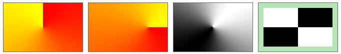
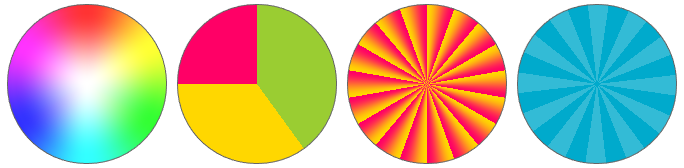

The `conic-gradient`{:.prop} and `repeating-conic-gradient`{:.prop} decorators render a conic color gradient across its element, at a given angle and position. RCSS supports most of the [CSS conic gradient](https://drafts.csswg.org/css-images-4/#conic-gradients) features, with the exception of *color hints*.

```css
decorator: conic-gradient( <conic-geometry>?, <color-stop-list> ) <paint-area>?;
decorator: repeating-conic-gradient( <conic-shape>?, <color-stop-list> ) <paint-area>?;
```

Each conic gradient is defined by a *gradient line*, which is a virtual line along which color stops are placed. Colors are interpolated between color stops. For conic gradients, the gradient line is an ellipsis around a center point. The colors vary along this ellipsis, while the rays going from the center to the ellipsis have constant color.

The repeating variant of the conic gradient will repeat the stops before the first color stop, and after the last color stop.

In order to display conic gradients, the backend renderer must support advanced effects. In particular, this decorator requires [conic gradient shader](../../cpp_manual/interfaces/render.html#shaders) support. Please see the [supported renderer features](https://github.com/mikke89/RmlUi?tab=readme-ov-file#renderers) for the built-in backends.


### Properties

`conic-geometry`{:.prop}

Value: | \[from \<angle\>\]? \[at \<position\>\]?
Initial: | from 0deg at center
Percentages: | N/A

Specifies the angle and position of the conic gradient.

The individual arguments are defined as follows:

> \<angle\>

Determines the angle the gradient starts at, with `0deg`{:.value} starting at the top.

> \<position\> = \[left \| center \| right \| \<length-percentage\> \] <span class="prop-def-symbol" title="one or more options must occur">\|\|</span> \[top \| center \| bottom \| \<length-percentage\>\]

Determines the center of the gradient. Percentages are resolved against the size of the box.

`color-stop-list`{:.prop}

Value: | \<color-stop-list\>
Initial: | N/A
Percentages: | N/A

Declares a comma-separated list of color stops that define the colors of the gradient. Each color stop specifies a color and a length along the gradient line. The color stop list is formally defined as follows:

> \<color-stop-list\> = \<color-stop\><span class="prop-def-symbol" title="Two or more comma-separated occurrences">#{2,}</span>
>
> \<color-stop\> = \<color\> \<length-percentage\><span class="prop-def-symbol" title="zero to two space-separated occurrences">{0,2}</span>

The color stop length specifies how far along the gradient line the stop is located. If no length is provided, the stop is automatically placed evenly between other stops. If one length is provided, the stop is added at this location. If two lengths are provided, then one stop is added for each length, of the same color. Percentages are resolved against the length of the gradient line.

Note that, the color stops in RCSS do not support *color hints* from CSS.

`paint-area`{:.prop}

Value: | border-box \| padding-box \| content-box
Initial: | padding-box
Percentages: | N/A

Declares the box area to render the decorator onto.


### Examples

The following RCSS declares a button with a repeating conic gradient decorator.

```css
button {
    decorator: repeating-conic-gradient(from 90deg, #ffd700, #f06, #ffd700 180deg);
    box-sizing: border-box;
    width: 200px;
    height: 100px;
    line-height: 100px;
    border-radius: 15px;
    border: 3px #ffd700;
    padding: 10px 35px;
    font-size: 30px;
    color: white;
    font-weight: bold;
    letter-spacing: 1px;
    font-effect: glow(3px #ff6a), outline(2px #0003);
}
```


Additional examples, demonstrating a variety of options.

```css
.gradient1 {
    decorator: conic-gradient(red, yellow);
}
.gradient2 {
    decorator: conic-gradient(from 90deg at 75% 50%, red, yellow);
}
.gradient3 {
    decorator: conic-gradient(from 45deg, white, black, white);
}
.checkerboard {
    background-color: #b3e6b3;
    decorator: conic-gradient(black 25%, white 0 50%, black 0 75%, white 0) content-box;
}
```



By adding a border radius, we can make circularly shaped elements with some interesting gradients. The last circular example here will be animating with a spinning effect.

```css
div {
  	border-radius: 100px;
}
.color_wheel {
    decorator: radial-gradient(white, #fff3 65%, transparent), conic-gradient(red, yellow, lime, aqua, blue, #f0f, red);
}
.pie_chart {
    decorator: conic-gradient(#9acd32 40%, #ffd700 0 75%, #f06 0);
 }
.repeating {
    decorator: repeating-conic-gradient(#ffd700, #f06 20deg);
}
@keyframes spinner {
    from { decorator: repeating-conic-gradient(from   0deg, #fff3 0 15deg, #fff0 0 30deg); }
    to   { decorator: repeating-conic-gradient(from 360deg, #fff3 0 15deg, #fff0 0 30deg); }
}
.repeating_spinning {
    background-color: #0ac;
    animation: 5s spinner infinite;
}
```


