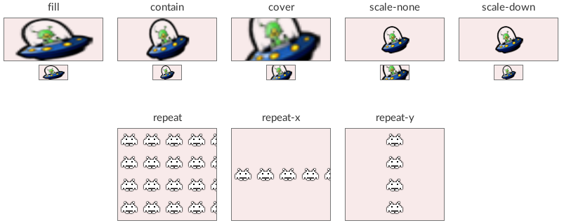
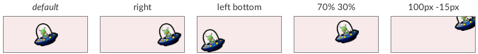

The `image`{:.prop} decorator can render a single sprite or image.

```css
decorator: image( <image-src> <image-orientation>? <image-fit>? <image-align-x>? <image-align-y>? ) <paint-area>?;
```
Values must be specified in the given order, any unspecified properties will be left at their default values. See the 'demo' sample for usage examples.

### Properties

`image-src`{:.prop}

Value: | \<string\>
Initial: | N/A
Percentages: | N/A

This property defines either a [sprite name](../sprite_sheets.html) or a relative path to an image file.

`image-orientation`{:.prop}

Value: | none \| flip-horizontal \| flip-vertical \| rotate-180
Initial: | none
Percentages: | N/A

Flips or rotates the image.

`image-fit`{:.prop}

Value: | fill \| contain \| cover \| scale-none \| scale-down \| repeat \| repeat-x \| repeat-y
Initial: | fill
Percentages: | N/A

`fill`{:.value}
: The image is stretched to boundaries.

`contain`{:.value}
: The image is stretched to boundaries, keeping aspect ratio fixed, 'letter-boxed'.

`cover`{:.value}
: The image is stretched to cover the boundaries, keeping aspect ratio fixed.

`scale-none`{:.value}
: The image is never scaled.

`scale-down`{:.value}
: The image acts like 'scale-none' if smaller than boundaries, or like 'contain' otherwise.

`repeat`{:.value}
: The image is tiled, repeating both horizontally and vertically. It does not work on sprite images.

`repeat-x`{:.value}
: The image is horizontally tiled along the X-axis. It does not work on sprite images.

`repeat-y`{:.value}
: The image is vertically tiled along the Y-axis. It does not work on sprite images.


`image-align-x`{:.prop}

Value: | left \| center \| right \| \<length-percentage\>
Initial: | center
Percentages: | relative to the element's padding width

Horizontally align or offset the image.

`image-align-y`{:.prop}

Value: | top \| center \| bottom \| \<length-percentage\>
Initial: | center
Percentages: | relative to the element's padding height

Vertically align or offset the image.


`paint-area`{:.prop}

Value: | border-box \| padding-box \| content-box
Initial: | padding-box
Percentages: | N/A

Declares the box area to render the decorator onto.

### Examples

The following demonstrates some examples of using the `image`{:.prop} decorator.

```css
.star {
    decorator: image("star.png" cover);
}
.top-right-aligned-sprite {
    decorator: image(icon-invader scale-none 70% 30%);
}
.repeat {
    decorator: image("/assets/alien_small.tga" repeat);
}
.custom-border {
    border-width: 20px 10px;
    border-color: transparent;
    decorator: image("my-custom-border.png") border-box;
}
```

### Modifiers

The image can be positioned, scaled, and transformed according to the above modifier properties. This section demonstrates the results of using these modifiers. Many of them manipulate the following image:

{:.center}


#### Fit modes

The `image-fit`{:.prop} property.



#### Alignment modes

The `image-align-x`{:.prop} and `image-align-y`{:.prop} properties. Here, using `image-fit: scale-none`{:.value}.



#### Orientation

The `image-orientation`{:.prop} property.


