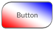
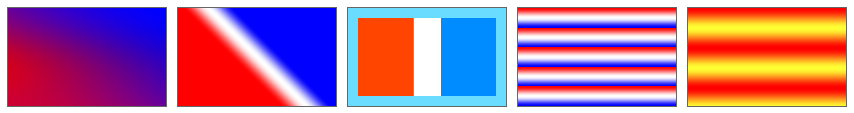

The `linear-gradient`{:.prop} and `repeating-linear-gradient`{:.prop} decorators render a linear color gradient across its element, along any specified direction. RCSS supports most of the [CSS linear gradient](https://drafts.csswg.org/css-images-3/#linear-gradients) features, including some [level 4](https://drafts.csswg.org/css-images-4/#linear-gradients) features, with the exception of *color hints*.

```css
decorator: linear-gradient( <direction>?, <color-stop-list> ) <paint-area>?;
decorator: repeating-linear-gradient( <direction>?, <color-stop-list> ) <paint-area>?;
```

Each linear gradient is defined by a *gradient line*, which is a virtual line along which color stops are placed. Colors are interpolated between color stops. For linear gradients, the gradient line is straight with each line perpendicular to this one having the same color.

The repeating variant of the linear gradient will repeat the stops before the first color stop, and after the last color stop.

In order to display linear gradients, the backend renderer must support advanced effects. In particular, this decorator requires [linear gradient shader](../../cpp_manual/interfaces/render.html#shaders) support. Please see the [supported renderer features](https://github.com/mikke89/RmlUi?tab=readme-ov-file#renderers) for the built-in backends.


### Properties

`direction`{:.prop}

Value: | \<angle\> \| to \[left \| right <span class="prop-def-symbol" title="one or more options must occur">\|\|</span> top \| bottom\]
Initial: | to bottom
Percentages: | N/A

Specifies the direction of the gradient, where `0deg` means up and `90deg` means right. One can also use keywords, e.g. `to top left` to specify a corner, or `to right` to specify an edge.

When specifying `to <corner>`, the gradient starting and ending points will be placed so that the normal to the gradient line intersects the chosen corner and the opposite corner. This ensures that the `0%` and `100%` color stop positions are placed exactly on these same corners.

`color-stop-list`{:.prop}

Value: | \<color-stop-list\>
Initial: | N/A
Percentages: | N/A

Declares a comma-separated list of color stops that define the colors of the gradient. Each color stop specifies a color and a length along the gradient line. The color stop list is formally defined as follows:

> \<color-stop-list\> = \<color-stop\><span class="prop-def-symbol" title="Two or more comma-separated occurrences">#{2,}</span>
>
> \<color-stop\> = \<color\> \<length-percentage\><span class="prop-def-symbol" title="Zero to two space-separated occurrences">{0,2}</span>

The color stop length specifies how far along the gradient line the stop is located. If no length is provided, the stop is automatically placed evenly between other stops. If one length is provided, the stop is added at this location. If two lengths are provided, then one stop is added for each length, of the same color. Percentages are resolved against the length of the gradient line.

Note that, the color stops in RCSS do not support *color hints* from CSS.

`paint-area`{:.prop}

Value: | border-box \| padding-box \| content-box
Initial: | padding-box
Percentages: | N/A

Declares the box area to render the decorator onto.


### Examples

The following RCSS declares a button with a diagonally oriented linear gradient.

```css
button {
    decorator: linear-gradient(to top right, red, white, blue);
    border-radius: 20px 8px;
    border-width: 2px 1px;
    border-color: #666;
}
```



Additional examples, demonstrating a variety of options.

```css
.gradient1 {
    decorator: linear-gradient(to bottom, #00f3, #0001, #00f3), linear-gradient(to top right, red, blue);
}
.gradient2 {
    decorator: linear-gradient(45deg, red 40%, white, blue 60%);
}
.gradient3 {
    background-color: #69dcff;
    decorator: linear-gradient(90deg, #ff4500 40%, white 40% 60%, #008cff 60%) content-box;
}
.gradient4 {
    decorator: repeating-linear-gradient(red, white, blue 20%);
}
.gradient5 {
    decorator: repeating-linear-gradient(to bottom, red, #ff3 20px, red 40px);
}
```


