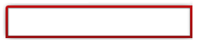

The `ninepatch`{:.prop} decorator splits a sprite into a 3x3 grid of patches by declaring another inner sprite. The corners of the ninepatch are rendered at their native size by default, while the inner patches are stretched so that the whole element is filled. In a sense, it can be considered a simplified and more performant version of the `tiled-box`{:.prop} decorator.

```css
decorator: ninepatch( <outer>, <inner>, <edge>? ) <paint-area>?;
```


### Properties

`outer`{:.prop}

Value: | \<string\>
Initial: | N/A
Percentages: | N/A

This property defines a [sprite name](../sprite_sheets.html). The sprite declares the outer rectangle of the decorator. Image urls cannot be used in this decorator.

`inner`{:.prop}

Value: | \<string\>
Initial: | N/A
Percentages: | N/A

This property defines a [sprite name](../sprite_sheets.html), and must be located in the same sprite sheet as `outer`{:.prop}. The inner sprite declares the inner rectangle of the decorator.

The area between the inner and outer rectangle defines the decorator's corners and edges. The corners are fixed in size, the edges only scale in one direction, while the center is stretched to cover the remaining area of the element's boundaries.

`edge`{:.prop}

Value: | \<number-length-percentage-box\>
Initial: | 0px 0px 0px 0px
Percentages: | relative to the size of the edge and current dp-ratio

The edge property is specified in the common `top-right-bottom-left`{:.value} box order. If the property is specified (not all 0px), the rendered size of each edge can be specified as a length, or number/percentage to scale it relative to the natural size of the image edge. The natural size is determined by the sprite's associated [`resolution`{:.prop} property](../sprite_sheets.html#resolution) and the current [dp-ratio](../syntax.html#dp-unit). The normal box shorthands are available, e.g., a single value will be replicated to all edges.

`paint-area`{:.prop}

Value: | border-box \| padding-box \| content-box
Initial: | padding-box
Percentages: | N/A

Declares the box area to render the decorator onto.


### Example

In this example, a ninepatch decorator for a text area is defined. The decorator is specified by two sprites, defining an outer and an inner rectangle.

```css
@spritesheet textarea {
	src: textarea.png;
	textarea: 0px 0px 145px 31px;
	textarea-inner: 11px 13px 127px 10px;
}
```

The sprites are illustrated in the following image, where the outer sprite covers the full image, while the inner sprite is located within the displayed border.


The inner rectangle defines the parts of the sprite that will be stretched when the element is resized.

The `ninepatch`{:.prop} decorator is applied as follows:

```css
.ninepatch {
	decorator: ninepatch(textarea, textarea-inner);
}
```

When the ninepatch decorator is applied and the element is stretched, the following is rendered. Notice that the corners stay fixed, and the inner sprite is stretched.



Furthermore, the ninepatch decorator can have the rendered size of its edges specified manually.

```css
decorator: ninepatch(textarea, textarea-inner, 19px 12px 25px 12px);
```

Percent and numbers can also be used, they will scale relative to the natural size of the given edge. Thus, the following will double the size of all edges.

```css
decorator: ninepatch(textarea, textarea-inner, 2.0);
```
