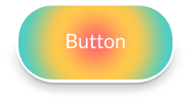
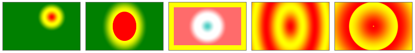

The `radial-gradient`{:.prop} and `repeating-radial-gradient`{:.prop} decorators render a radial color gradient across its element, of a given size and position. RCSS supports most of the [CSS radial gradient](https://drafts.csswg.org/css-images-3/#radial-gradients) features, including some [level 4](https://drafts.csswg.org/css-images-4/#radial-gradients) features, with the exception of *color hints*.

```css
decorator: radial-gradient( <radial-geometry>?, <color-stop-list> ) <paint-area>?;
decorator: repeating-radial-gradient( <radial-geometry>?, <color-stop-list> ) <paint-area>?;
```

Each radial gradient is defined by a *gradient line*, which is a virtual line along which color stops are placed. Colors are interpolated between color stops. For radial gradients, the gradient line starts at a center point and moves out toward an ellipsis around the center. Thus, the color varies going out from the center, but are constant along the virtual ellipses surrounding the center.

The repeating variant of the radial gradient will repeat the stops before the first color stop, and after the last color stop.

In order to display radial gradients, the backend renderer must support advanced effects. In particular, this decorator requires [radial gradient shader](../../cpp_manual/interfaces/render.html#shaders) support. Please see the [supported renderer features](https://github.com/mikke89/RmlUi?tab=readme-ov-file#renderers) for the built-in backends.


### Properties

`radial-geometry`{:.prop}

Value: | \[\<radial-shape\> <span class="prop-def-symbol" title="one or more options must occur">\|\|</span> \<radial-size\>\]? \[at \<position\>\]?
Initial: | circle farthest-corner at center
Percentages: | N/A

Specifies the shape, size, and position of the radial gradient within its box.

The individual arguments are defined as follows:

> \<radial-shape\> = circle \| ellipse

Determines whether or not the ending shape is a circle or an ellipse. If omitted, it is considered a circle if `radial-size`{:.value} is a single length, otherwise an ellipse.

> \<radial-size\> = closest-side \| farthest-side \| closest-corner \| farthest-corner \| \<length\> \| \<length-percentage\><span class="prop-def-symbol" title="two space-separated occurrences">{2}</span>

Determines the size of the ending shape. The keywords determine the size such that the shape ends at the specified edge or corner. A single length specifies a circle of that radius. Two lengths or percentages specify an ellipse with the given two-dimensional radius, percentages being resolved against the size of the box along each dimension.

> \<position\> = \[left \| center \| right \| \<length-percentage\> \] <span class="prop-def-symbol" title="one or more options must occur">\|\|</span> \[top \| center \| bottom \| \<length-percentage\>\]

Determines the center of the gradient. Percentages are resolved against the size of the box.

`color-stop-list`{:.prop}

Value: | \<color-stop-list\>
Initial: | N/A
Percentages: | N/A

Declares a comma-separated list of color stops that define the colors of the gradient. Each color stop specifies a color and a length along the gradient line. The color stop list is formally defined as follows:

> \<color-stop-list\> = \<color-stop\><span class="prop-def-symbol" title="Two or more comma-separated occurrences">#{2,}</span>
>
> \<color-stop\> = \<color\> \<length-percentage\><span class="prop-def-symbol" title="zero to two space-separated occurrences">{0,2}</span>

The color stop length specifies how far along the gradient line the stop is located. If no length is provided, the stop is automatically placed evenly between other stops. If one length is provided, the stop is added at this location. If two lengths are provided, then one stop is added for each length, of the same color. Percentages are resolved against the length of the gradient line.

Note that, the color stops in RCSS do not support *color hints* from CSS.

`paint-area`{:.prop}

Value: | border-box \| padding-box \| content-box
Initial: | padding-box
Percentages: | N/A

Declares the box area to render the decorator onto.


### Examples

The following RCSS declares a button with a radial gradient decorator.

```css
button {
    decorator: radial-gradient(circle farthest-side at center, #ff6b6b, #fec84d, #4ecdc4);
    border-radius: 50px;
    border: 4px #fff;
    box-shadow: #000a 0 4px 12px, #000a 0 1px 3px;
}
```



Additional examples, demonstrating a variety of options.

```css
.gradient1 {
    decorator: radial-gradient(circle closest-side at 100px 30px, red, yellow, green);
}
.gradient2 {
    decorator: radial-gradient(30% 60%, red 50%, yellow 50%, green);
}
.gradient3 {
    background-color: yellow;
    decorator: radial-gradient(40px, #4ecdc4, white 40% 60%, #ff6b6b) content-box;
}
.gradient4 {
    decorator: repeating-radial-gradient(50px 80px, #f00, #ff0, #f00);
}
.gradient5 {
    decorator: repeating-radial-gradient(circle closest-side, yellow, red 2px, yellow);
}
```


