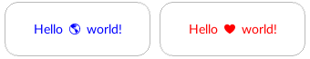

The `text`{:.prop} decorator can render text in the background of an element. This can be particularly helpful when using icon fonts, and even allows using such fonts for generated elements.

```css
decorator: text( <text> <color>? <align-x>? <align-y>? ) <paint-area>?;
```
Values must be specified in the given order, except that alignment keywords can be given in any order. Any unspecified properties will be left at their default values.

The font face will be inherited from the element it is being applied to. Thus, the appropriate font family and font size should be set on the element itself. However, the decorator can be colored independently. Further, the text can be freely aligned within the element.

### Properties

`text`{:.prop}

Value: | \<string\>
Initial: | N/A
Percentages: | N/A

This property defines the text to be rendered. This decorator supports only a single line of text. Any [RML character entities](../../rml/syntax.md) will be decoded, so it is possible to refer to Unicode characters e.g. by `&#x1F30E;`.

`color`{:.prop}

Value: | \<color\> \| inherit-color
Initial: | inherit-color
Percentages: | N/A

Specifies the color the text should be rendered in. By default, it inherits the color from the element the decorator is being applied to.

`align-x`{:.prop}

Value: | left \| center \| right \| \<length-percentage\>
Initial: | center
Percentages: | relative to the specified paint area

Horizontally align or offset the text.

`align-y`{:.prop}

Value: | top \| center \| bottom \| \<length-percentage\>
Initial: | center
Percentages: | relative to the specified paint area

Vertically align or offset the text.


`paint-area`{:.prop}

Value: | border-box \| padding-box \| content-box
Initial: | padding-box
Percentages: | N/A

Declares the box area to render the decorator onto.

### Examples

The following demonstrates some examples of using the `text`{:.prop} decorator.

```css
.decorator1 {
    decorator: text("Hello 🌎 world!" #333);
}
.decorator2 {
    decorator: text("Hello &#x1F30E; world!" top left);
}
.decorator3 {
    decorator: text("Hello 🌎 world!" 50% 30dp);
}
.decorator4 {
    decorator: text("Hello 🌎 world!" red right bottom) content-box;
    padding: 10px;
}

sliderarrowdec, slidearrowinc {
	width: 32dp;
	height: 32dp;
	font-family: my-icon-font;
	font-size: 20dp;
}
sliderarrowdec { decorator: text("🔼"); }
sliderarrowinc { decorator: text("🔽"); }
```

Example output:

{:.center}

