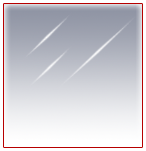
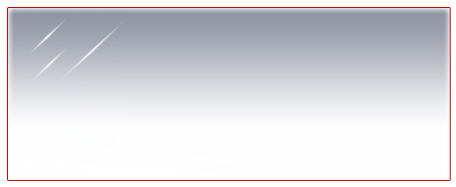
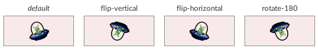

The `tiled-box`{:.prop} decorator can render nine sprites or images across an element. One image is placed at a fixed size in each of the element's corners, one image is stretched along each edge, and a final image is stretched in both directions to cover the center region of the image.

```css
decorator: tiled-horizontal(
	<top-left-image-src> <top-left-image-orientation>?,
	<top-image-src> <top-image-orientation>?,
	<top-right-image-src> <top-right-image-orientation>?,

	<left-image-src> <left-image-orientation>?,
	<center-image-src> <center-image-orientation>?,
	<right-image-src> <right-image-orientation>?,

	<bottom-left-image-src> <bottom-left-image-orientation>?,
	<bottom-image-src> <bottom-image-orientation>?,
	<bottom-right-image-src> <bottom-right-image-orientation>?
) <paint-area>?;
```


### Properties


`*x*-image-src`{:.prop}

Value: | \<string\>
Initial: | N/A
Percentages: | N/A

This property defines either a [sprite name](../sprite_sheets.html) or a relative path to an image file.

`*x*-image-orientation`{:.prop}

Value: | none \| flip-horizontal \| flip-vertical \| rotate-180
Initial: | none
Percentages: | N/A

Flips or rotates the image.

`paint-area`{:.prop}

Value: | border-box \| padding-box \| content-box
Initial: | padding-box
Percentages: | N/A

Declares the box area to render the decorator onto.


### Example

The following image is used to define a window background.



The `tiled-box`{:.prop} decorator is first defined by dividing the image into nine regions (see below). Then, the elements that use this decorator can be gracefully sized in any direction, keeping the corners and edges at a proper size.



The following RCSS is used for the above result.

```css
@spritesheet demo-sheet
{
	src: /assets/invader.tga;

	window-tl: 0px 0px 133px 140px;
	window-t:  134px 0px 1px 140px;
	window-tr: 136px 0px 10px 140px;
	window-l:  0px 139px 10px 1px;
	window-c:  11px 139px 1px 1px;
	window-r:  10px 139px -10px 1px; /* mirrored left */
	window-bl: 0px 140px 11px 11px;
	window-b:  11px 140px 1px 11px;
	window-br: 136px 140px 10px 11px;
}

.tiled-box {
	decorator: tiled-box(
		window-tl, window-t, window-tr,
		window-l, window-c, window-r,
		window-bl, window-b, window-br
	);
}
```


#### Orientation

The result of using the `*x*-image-orientation`{:.prop} properties is demonstrated in the following, which can be applied to each tile individually.


