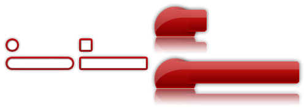

The `tiled-horizontal`{:.prop} decorator can render three sprites or images, horizontally across an element. One image is placed on the left edge, another on the right edge, and the last is stretched across the middle.

```css
decorator: tiled-horizontal(
	<left-image-src> <left-image-orientation>?,
	<center-image-src> <center-image-orientation>?,
	<right-image-src> <right-image-orientation>?
) <paint-area>?;
```


### Properties

`*x*-image-src`{:.prop}

Value: | \<string\>
Initial: | N/A
Percentages: | N/A

This property defines either a [sprite name](../sprite_sheets.html) or a relative path to an image file.

`*x*-image-orientation`{:.prop}

Value: | none \| flip-horizontal \| flip-vertical \| rotate-180
Initial: | none
Percentages: | N/A

Flips or rotates the image.

`paint-area`{:.prop}

Value: | border-box \| padding-box \| content-box
Initial: | padding-box
Percentages: | N/A

Declares the box area to render the decorator onto.


### Examples

In each of the following examples an image is displayed at its native size first, and then the `tiled-horizontal`{:.prop} decorator is applied to it with its element stretched horizontally.



The following RCSS is used for the above result.

```css
@spritesheet demo-sheet
{
	src: /assets/invader.tga;

	title-bar-l: 147px 0px 82px 85px;
	title-bar-c: 229px 0px  1px 85px;
	title-bar-r: 231px 0px 15px 85px;

	demo-radio-l: 407px 0px 14px 30px;
	demo-radio-m: 421px 0px  2px 30px;
	demo-radio-r: 423px 0px 14px 30px;

	demo-checkbox-l: 407px 60px 14px 30px;
	demo-checkbox-m: 421px 60px  2px 30px;
	demo-checkbox-r: 423px 60px 14px 30px;
}

.radio {
    decorator: tiled-horizontal( demo-radio-l, demo-radio-m, demo-radio-r );
}
.checkbox {
    decorator: tiled-horizontal( demo-checkbox-l, demo-checkbox-m, demo-checkbox-r );
}
.title-bar {
    decorator: tiled-horizontal( title-bar-l, title-bar-c, title-bar-r );
}
```


#### Orientation

The result of using the `*x*-image-orientation`{:.prop} properties is demonstrated in the following, which can be applied to each tile individually.


