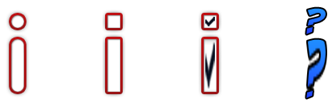

The `tiled-vertical`{:.prop} decorator can render three sprites or images, vertically across an element. One image is placed on the top edge, another on the bottom edge, and the last is stretched across the middle.

```css
decorator: tiled-horizontal(
	<top-image-src> <top-image-orientation>?,
	<center-image-src> <center-image-orientation>?,
	<bottom-image-src> <bottom-image-orientation>?
) <paint-area>?;
```

### Properties

`*x*-image-src`{:.prop}

Value: | \<string\>
Initial: | N/A
Percentages: | N/A

This property defines either a [sprite name](../sprite_sheets.html) or a relative path to an image file.

`*x*-image-orientation`{:.prop}

Value: | none \| flip-horizontal \| flip-vertical \| rotate-180
Initial: | none
Percentages: | N/A

Flips or rotates the image.

`paint-area`{:.prop}

Value: | border-box \| padding-box \| content-box
Initial: | padding-box
Percentages: | N/A

Declares the box area to render the decorator onto.


### Examples

In each of the following examples an image is displayed at its native size first, and then the `tiled-vertical`{:.prop} decorator is applied to it with its element stretched vertically.



Clearly, not all images are designed to stretch like this. However, one can certainly envision a usage for the first two examples.

The following RCSS is used for the above result.

```css
@spritesheet demo-sheet
{
	src: /assets/invader.tga;

	demo-radio-t: 407px  0px 30px 14px;
	demo-radio-c: 407px 14px 30px  2px;
	demo-radio-b: 407px 16px 30px 14px;

	demo-checkbox-t: 407px 60px 30px 14px;
	demo-checkbox-c: 407px 74px 30px  2px;
	demo-checkbox-b: 407px 76px 30px 14px;

	demo-checked-t: 407px  90px 30px  8px;
	demo-checked-c: 407px  98px 30px 14px;
	demo-checked-b: 407px 112px 30px  8px;

	demo-help-t:    128px 152px 51px  6px;
	demo-help-c:    128px 158px 51px 21px;
	demo-help-b:    128px 179px 51px 12px;
}

.radio {
    decorator: tiled-vertical( demo-radio-t, demo-radio-c, demo-radio-b );
}
.checkbox {
    decorator: tiled-vertical( demo-checkbox-t, demo-checkbox-c, demo-checkbox-b );
}
.checked {
    decorator: tiled-vertical( demo-checked-t, demo-checked-c, demo-checked-b );
}
.help {
    decorator: tiled-vertical( demo-help-t, demo-help-c, demo-help-b );
}
```


#### Orientation

The result of using the `*x*-image-orientation`{:.prop} properties is demonstrated in the following, which can be applied to each tile individually.


